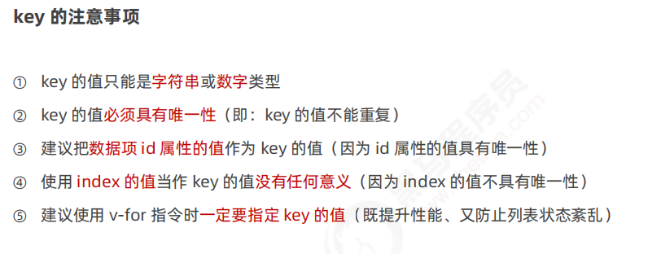

# Vue2&&Vue3

学习流程


## 前端工程化和webpack


### 前端工程化


### webpack的基本使用


>
>
>注意：所有源代码都写在src目录下

 

#### 安装和配置webpack


>
>
>注意：不明确是哪种类型可以去npmjs官网上去搜索


>理解：打包是指webpack根据entry和ouput节点自动生成了能够解决兼容性等问题的文件，并存放到某些特定的位置，可以理解成资源分类与整合，便于进行模块化管理
>
>注意：必须在根目录下运行npm命令行
>
>运行上述命令后，webpack就自动在main.js中解决了兼容性问题，故此时引入html文件的应该是main.js文件而不是index.js


>
>
>注意：重新配置config文件后，如上例中的mode节点改变，需要重新运行script节点下的脚本，才能实现压缩文件的功能


>
>
>注意：__dirname指的是config文件所在的文件夹路径，即上一级路径

### webpack中的插件

#### webpack-dev-server


> 注意：运行插件后每次修改源代码后只需要保存后即可自动进行打包
>
> 该插件会把例子中的bundle.js放入内存中，便于快速读取，故引入文件时需要/bundle.js即可
>
> 且访问浏览器时，浏览器会自动访问文件夹中的index.html，每次修改代码并访问浏览器时，需要手动进入src文件， 比较麻烦，故可以使用以下插件


#### html-webpack-plugin

插件功能：1.将src文件下的index.html文件自动赋值到根目录下，便于直接访问浏览器页面

   				 2.自动为html文件引入内存中的bundle.js文件


>注意：打包的永远只是js文件，html文件只是复制
>
>插件使用小结：先引入插件模块，再实例化插件对象并用常量接受，最后暴露以键值对的形式在exports中，即挂载到module对象上


>
>
>注意：手动配置webpack较为繁琐，故可以通过vue-cli（vue脚手架）插件去帮助我们自动配置webpack

#### devserver节点


注意：config文件修改后想要达到修改网页效果必须重启服务器，即两次ctrl+c


#### loader加载器


##### 配置加载css文件的loader


##### 配置加载less文件的loader


>
>
>注意：less是内置依赖项，只有安装了less才能安装并使用less-loader

##### 配置加载图片的loader

> 注意：服务器读取html文件中的标签后 ，才会去发起请求来展示普通图片， 而base64网站生成的图片会在读取标签的同时就读取图片字符串，从而不需要服务器重复访问（精灵图也能达到相同的目的） 但是图片体积会变大，具体见https://blog.51cto.com/u_15061934/4661633


>limit参数的单位是byte
>
>注意：webpack处理样式表文件的方式：在indexjs文件中无名导入css类文件后，webpack会自动将css文件转义为js格式注入到打包的bundlejs文件,但物理磁盘中不会显示，需在客户端才能找到


##### babel-loader


>
>
>注意：webpack无法识别的js高级代码会首先交给babel-loader，babel-loader再交给plugins识别，最终结果再返回给webpack，因为plugins是babel-loader的依赖项


>
>
>注意：exclude参数排除了module文件中的js代码，可以节省转码的时间，因为该文件自身就解决了兼容性等问题且不归开发者管，所以要排除掉


#### 打包发布

##### 配置build命令


>1.为了确保开发时的效率，mode的默认值一般是development，通过指定--model会覆盖默认值
>
>2.压缩的文件不会有注释，这是判断文件是否被压缩的标准
>
>3.理解：--model只是参数项，参数之前，只指定webpack，打包的文件会生成到实际物理磁盘中，只有指定了webpack server才会将打包的文件生成到内存中，故在项目发布阶段，需要指定为webpack即可


##### 配置图片和js文件的存放路径


>修改图片的存放路径可以使用&符号拼接在第一个参数后面
>
>注意：修改文件的路径再执行build命令（发布）后，旧文件仍然存在，故需手动删除旧文件

##### 自动清理dist目录下的旧文件


>
>
>注意：安装需要的插件可以自己去npmjs官网去查看安装和使用方法


#### Source Map


报错的代码行数是bundlejs文件中的行数而不是源代码中的函数，故调试极不方便


坚决不推荐以下方式


#### 拓展：webpack中的@的原理和好处


以后可以修改所有涉及相对路径为@

#### 项目文件

webpack.config.js文件

```javascript
const path = require('path')

// 1. 导入 html-webpack-plugin 这个插件，得到插件的构造函数
const HtmlPlugin = require('html-webpack-plugin')
// 2. new 构造函数，创建插件的实例对象
const htmlPlugin = new HtmlPlugin({
  // 指定要复制哪个页面
  template: './src/index.html',
  // 指定复制出来的文件名和存放路径
  filename: './index.html'
})

// 注意：左侧的 { } 是解构赋值
const { CleanWebpackPlugin } = require('clean-webpack-plugin')

// 使用 Node.js 中的导出语法，向外导出一个 webpack 的配置对象
module.exports = {
  // 在开发调试阶段，建议大家都把 devtool 的值设置为 eval-source-map
  // devtool: 'eval-source-map',
  // 在实际发布的时候，建议大家把 devtool 的值设置为 nosources-source-map 或直接关闭 SourceMap
  devtool: 'nosources-source-map',
  // mode 代表 webpack 运行的模式，可选值有两个 development 和 production
  // 结论：开发时候一定要用 development，因为追求的是打包的速度，而不是体积；
  // 反过来，发布上线的时候一定能要用 production，因为上线追求的是体积小，而不是打包速度快！
  mode: 'development',
  // entry: '指定要处理哪个文件'
  entry: path.join(__dirname, './src/index1.js'),
  // 指定生成的文件要存放到哪里
  output: {
    // 存放的目录
    path: path.join(__dirname, 'dist'),
    // 生成的文件名
    filename: 'js/bundle.js'
  },
  // 3. 插件的数组，将来 webpack 在运行时，会加载并调用这些插件
  plugins: [htmlPlugin, new CleanWebpackPlugin()],
  devServer: {
    // 首次打包成功后，自动打开浏览器
    open: true,
    // 在 http 协议中，如果端口号是 80，则可以被省略
    port: 80,
    // 指定运行的主机地址
    host: '127.0.0.1'
  },
  module: {
    rules: [
      // 定义了不同模块对应的 loader
      { test: /\.css$/, use: ['style-loader', 'css-loader'] },
      // 处理 .less 文件的 loader
      { test: /\.less$/, use: ['style-loader', 'css-loader', 'less-loader'] },
      // 处理图片文件的 loader
      // 如果需要调用的 loader 只有一个，则只传递一个字符串也行，如果有多个loader，则必须指定数组
      // 在配置 url-loader 的时候，多个参数之间，使用 & 符号进行分隔
      { test: /\.jpg|png|gif$/, use: 'url-loader?limit=470&outputPath=images' },
      // 使用 babel-loader 处理高级的 JS 语法
      // 在配置 babel-loader 的时候，程序员只需要把自己的代码进行转换即可；一定要排除 node_modules 目录中的 JS 文件
      // 因为第三方包中的 JS 兼容性，不需要程序员关心
      { test: /\.js$/, use: 'babel-loader', exclude: /node_modules/ }
    ]
  },
  resolve: {
    alias: {
      // 告诉 webpack，程序员写的代码中，@ 符号表示 src 这一层目录
      '@': path.join(__dirname, './src/')
    }
  }
}

```


## Vue

### 在Chrome浏览器中安装vue-devtools调试工具

直接拖动相关文件到扩展程序即可


### Vue简介


### Vue的基本使用


### Vue的调试工具


### Vue的指令和过滤器

#### 指令

data是数据源


##### 内容渲染指令


>
>
>注意：1.插值表达式只能用在元素的内容节点，不能用在元素的属性节点
>
>2.插值表达式中只能写简单js表达式，而不能写js语句，例如if else语句等等


>如果渲染的不是纯文本内容，如包括标签，则info属性的值必须用单引号括起来，看成一个字符串型数据
>
>注意：el属性的值其实是选择器，故如果选定了在页面中多次出现的标签，会默认指定为第一个出现的标签


##### 属性绑定指令


##### 事件绑定指令


>
>
>注意：事件处理函数原型是addCount：function（）{}，但上述写法更简便

```javascript
<!DOCTYPE html>
<html lang="en">

<head>
  <meta charset="UTF-8">
  <meta http-equiv="X-UA-Compatible" content="IE=edge">
  <meta name="viewport" content="width=device-width, initial-scale=1.0">
  <title>Document</title>
</head>

<body>
  <!-- 希望 Vue 能够控制下面的这个 div，帮我们在把数据填充到 div 内部 -->
  <div id="app">
    <p>count 的值是：{{ count }}</p>
    <!-- 在绑定事件处理函数的时候，可以使用 () 传递参数 -->
    <!-- v-on: 指令可以被简写为 @ -->
    <button @click="add(1)">+1</button>
    <button @click="sub">-1</button>
  </div>

  <!-- 1. 导入 Vue 的库文件，在 window 全局就有了 Vue 这个构造函数 -->
  <script src="./lib/vue-2.6.12.js"></script>
  <!-- 2. 创建 Vue 的实例对象 -->
  <script>
    // 创建 Vue 的实例对象
    const vm = new Vue({
      // el 属性是固定的写法，表示当前 vm 实例要控制页面上的哪个区域，接收的值是一个选择器
      el: '#app',
      // data 对象就是要渲染到页面上的数据
      data: {
        count: 0
      },
      // methods 的作用，就是定义事件的处理函数
      methods: {
        add(n) {
          // 在 methods 处理函数中，this 就是 new 出来的 vm 实例对象
          // console.log(vm === this)
          console.log(vm)
          // vm.count += 1
          this.count += n
        },
        sub() {
          // console.log('触发了 sub 处理函数')
          this.count -= 1
        }
      }
    })
  </script>
</body>

</html>
```


##### 双向绑定指令


>
>
>注意：1.v-model实现的是双向数据绑定，故可以通过该指令赋予文本框数据源中的值为默认值，同时，修改文本框内的值也会改变数据源中的值
>
>2.该指令当且仅当与表单类元素绑定时具有意义，因为只有该类元素具有交互功能，二普通元素例如div p元素只能用于展示内容而不能产生交互效果


 >
 >
 >注意：lazy是指只在v-model改变结束时才会改变model中的值，改变结束的判断标准是文本框是否失去焦点


##### 条件渲染指令


>
>
>注意：如果初始标签时该标签不需要被显示，则使用v-if压根不会创建改元素，但v-show却会创建改元素，从而造成初始渲染开销，此时用v-if更好，所以说，需要认识到的事，没有任何事物或人是完美的，我们能做的只是按需使用，适合自己的才是最好的


##### 列表渲染指令


>
>
>注意：item对象除了可以被li的子元素访问，同时也可以被li元素自身访问


看下面哦




>
>
>注意：索引其实不具有唯一性，因为index无法与某一项强制绑定，但id却可以


#### 过滤器


### 品牌列表案例


