#  **Vue2**&&Vue3

学习流程


## 前端工程化和webpack

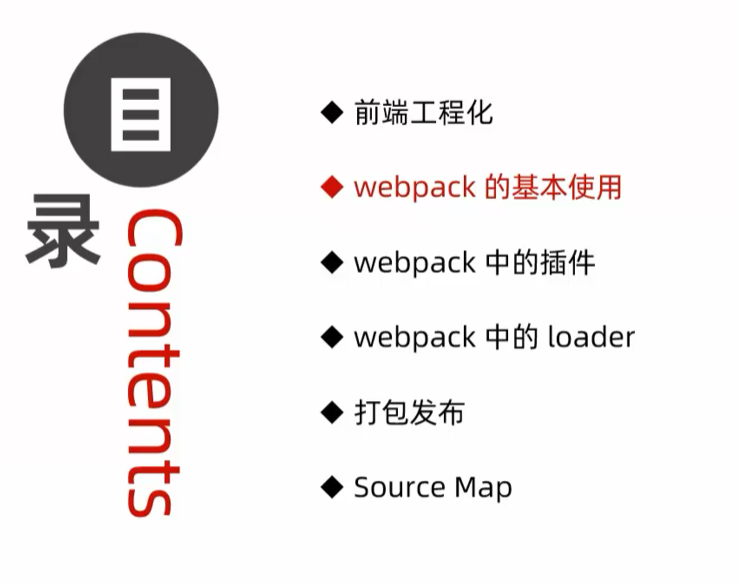


### 前端工程化


### webpack的基本使用


>
>
>注意：所有源代码都写在src目录下

 

#### 安装和配置webpack


>
>
>注意：不明确是哪种类型可以去npmjs官网上去搜索


>理解：打包是指webpack根据entry和ouput节点自动生成了能够解决兼容性等问题的文件，并存放到某些特定的位置，可以理解成资源分类与整合，便于进行模块化管理
>
>注意：必须在根目录下运行npm命令行
>
>运行上述命令后，webpack就自动在main.js中解决了兼容性问题，故此时引入html文件的应该是main.js文件而不是index.js


>
>
>注意：重新配置config文件后，如上例中的mode节点改变，需要重新运行script节点下的脚本，才能实现压缩文件的功能


>
>
>注意：__dirname指的是config文件所在的文件夹路径，即上一级路径

### webpack中的插件

#### webpack-dev-server


> 注意：运行插件后每次修改源代码后只需要保存后即可自动进行打包
>
> 该插件会把例子中的bundle.js放入内存中，便于快速读取，故引入文件时需要/bundle.js即可
>
> 且访问浏览器时，浏览器会自动访问文件夹中的index.html，每次修改代码并访问浏览器时，需要手动进入src文件， 比较麻烦，故可以使用以下插件


#### html-webpack-plugin

插件功能：1.将src文件下的index.html文件自动赋值到根目录下，便于直接访问浏览器页面

   				 2.自动为html文件引入内存中的bundle.js文件


>注意：打包的永远只是js文件，html文件只是复制
>
>插件使用小结：先引入插件模块，再实例化插件对象并用常量接受，最后暴露以键值对的形式在exports中，即挂载到module对象上


>
>
>注意：手动配置webpack较为繁琐，故可以通过vue-cli（vue脚手架）插件去帮助我们自动配置webpack

#### devserver节点


注意：config文件修改后想要达到修改网页效果必须重启服务器，即两次ctrl+c


#### loader加载器


##### 配置加载css文件的loader


##### 配置加载less文件的loader


>
>
>注意：less是内置依赖项，只有安装了less才能安装并使用less-loader

##### 配置加载图片的loader

> 注意：服务器读取html文件中的标签后 ，才会去发起请求来展示普通图片， 而base64网站生成的图片会在读取标签的同时就读取图片字符串，从而不需要服务器重复访问（精灵图也能达到相同的目的） 但是图片体积会变大，具体见https://blog.51cto.com/u_15061934/4661633


>limit参数的单位是byte
>
>注意：webpack处理样式表文件的方式：在indexjs文件中无名导入css类文件后，webpack会自动将css文件转义为js格式注入到打包的bundlejs文件,但物理磁盘中不会显示，需在客户端才能找到


##### babel-loader


>
>
>注意：webpack无法识别的js高级代码会首先交给babel-loader，babel-loader再交给plugins识别，最终结果再返回给webpack，因为plugins是babel-loader的依赖项


>
>
>注意：exclude参数排除了module文件中的js代码，可以节省转码的时间，因为该文件自身就解决了兼容性等问题且不归开发者管，所以要排除掉


#### 打包发布

##### 配置build命令


>1.为了确保开发时的效率，mode的默认值一般是development，通过指定--model会覆盖默认值
>
>2.压缩的文件不会有注释，这是判断文件是否被压缩的标准
>
>3.理解：--model只是参数项，参数之前，只指定webpack，打包的文件会生成到实际物理磁盘中，只有指定了webpack server才会将打包的文件生成到内存中，故在项目发布阶段，需要指定为webpack即可


##### 配置图片和js文件的存放路径


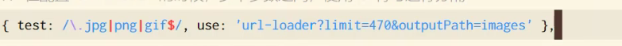

>修改图片的存放路径可以使用&符号拼接在第一个参数后面
>
>注意：修改文件的路径再执行build命令（发布）后，旧文件仍然存在，故需手动删除旧文件

##### 自动清理dist目录下的旧文件


>
>
>注意：安装需要的插件可以自己去npmjs官网去查看安装和使用方法


#### Source Map


报错的代码行数是bundlejs文件中的行数而不是源代码中的函数，故调试极不方便


坚决不推荐以下方式


#### 拓展：webpack中的@的原理和好处


以后可以修改所有涉及相对路径为@

#### 项目文件

webpack.config.js文件

```javascript
const path = require('path')

// 1. 导入 html-webpack-plugin 这个插件，得到插件的构造函数
const HtmlPlugin = require('html-webpack-plugin')
// 2. new 构造函数，创建插件的实例对象
const htmlPlugin = new HtmlPlugin({
  // 指定要复制哪个页面
  template: './src/index.html',
  // 指定复制出来的文件名和存放路径
  filename: './index.html'
})

// 注意：左侧的 { } 是解构赋值
const { CleanWebpackPlugin } = require('clean-webpack-plugin')

// 使用 Node.js 中的导出语法，向外导出一个 webpack 的配置对象
module.exports = {
  // 在开发调试阶段，建议大家都把 devtool 的值设置为 eval-source-map
  // devtool: 'eval-source-map',
  // 在实际发布的时候，建议大家把 devtool 的值设置为 nosources-source-map 或直接关闭 SourceMap
  devtool: 'nosources-source-map',
  // mode 代表 webpack 运行的模式，可选值有两个 development 和 production
  // 结论：开发时候一定要用 development，因为追求的是打包的速度，而不是体积；
  // 反过来，发布上线的时候一定能要用 production，因为上线追求的是体积小，而不是打包速度快！
  mode: 'development',
  // entry: '指定要处理哪个文件'
  entry: path.join(__dirname, './src/index1.js'),
  // 指定生成的文件要存放到哪里
  output: {
    // 存放的目录
    path: path.join(__dirname, 'dist'),
    // 生成的文件名
    filename: 'js/bundle.js'
  },
  // 3. 插件的数组，将来 webpack 在运行时，会加载并调用这些插件
  plugins: [htmlPlugin, new CleanWebpackPlugin()],
  devServer: {
    // 首次打包成功后，自动打开浏览器
    open: true,
    // 在 http 协议中，如果端口号是 80，则可以被省略
    port: 80,
    // 指定运行的主机地址
    host: '127.0.0.1'
  },
  module: {
    rules: [
      // 定义了不同模块对应的 loader
      { test: /\.css$/, use: ['style-loader', 'css-loader'] },
      // 处理 .less 文件的 loader
      { test: /\.less$/, use: ['style-loader', 'css-loader', 'less-loader'] },
      // 处理图片文件的 loader
      // 如果需要调用的 loader 只有一个，则只传递一个字符串也行，如果有多个loader，则必须指定数组
      // 在配置 url-loader 的时候，多个参数之间，使用 & 符号进行分隔
      { test: /\.jpg|png|gif$/, use: 'url-loader?limit=470&outputPath=images' },
      // 使用 babel-loader 处理高级的 JS 语法
      // 在配置 babel-loader 的时候，程序员只需要把自己的代码进行转换即可；一定要排除 node_modules 目录中的 JS 文件
      // 因为第三方包中的 JS 兼容性，不需要程序员关心
      { test: /\.js$/, use: 'babel-loader', exclude: /node_modules/ }
    ]
  },
  resolve: {
    alias: {
      // 告诉 webpack，程序员写的代码中，@ 符号表示 src 这一层目录
      '@': path.join(__dirname, './src/')
    }
  }
}

```


## Vue

### 在Chrome浏览器中安装vue-devtools调试工具

直接拖动相关文件到扩展程序即可


### Vue简介


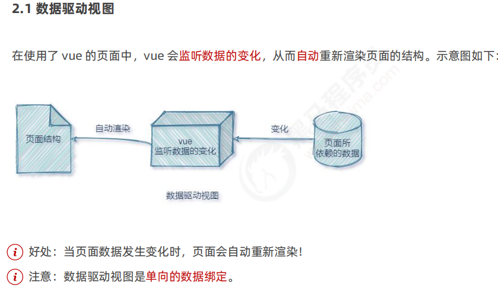


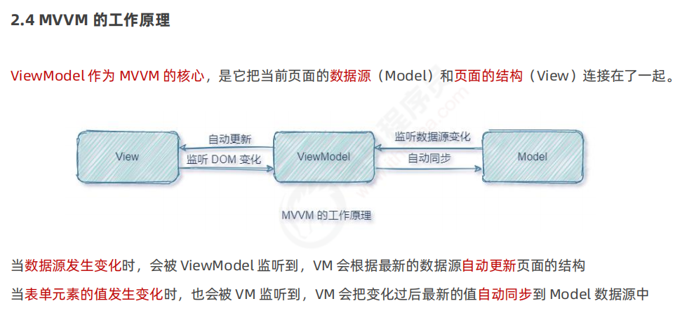


### Vue的基本使用


### Vue的调试工具


### Vue的指令和过滤器

#### 指令

data是数据源


##### 内容渲染指令


>
>
>注意：1.插值表达式只能用在元素的内容节点，不能用在元素的属性节点
>
>2.插值表达式中只能写简单js表达式，而不能写js语句，例如if else语句等等


>如果渲染的不是纯文本内容，如包括标签，则info属性的值必须用单引号括起来，看成一个字符串型数据
>
>注意：el属性的值其实是选择器，故如果选定了在页面中多次出现的标签，会默认指定为第一个出现的标签


##### 属性绑定指令


##### 事件绑定指令


>
>
>注意：事件处理函数原型是addCount：function（）{}，但上述写法更简便

```javascript
<!DOCTYPE html>
<html lang="en">

<head>
  <meta charset="UTF-8">
  <meta http-equiv="X-UA-Compatible" content="IE=edge">
  <meta name="viewport" content="width=device-width, initial-scale=1.0">
  <title>Document</title>
</head>

<body>
  <!-- 希望 Vue 能够控制下面的这个 div，帮我们在把数据填充到 div 内部 -->
  <div id="app">
    <p>count 的值是：{{ count }}</p>
    <!-- 在绑定事件处理函数的时候，可以使用 () 传递参数 -->
    <!-- v-on: 指令可以被简写为 @ -->
    <button @click="add(1)">+1</button>
    <button @click="sub">-1</button>
  </div>

  <!-- 1. 导入 Vue 的库文件，在 window 全局就有了 Vue 这个构造函数 -->
  <script src="./lib/vue-2.6.12.js"></script>
  <!-- 2. 创建 Vue 的实例对象 -->
  <script>
    // 创建 Vue 的实例对象
    const vm = new Vue({
      // el 属性是固定的写法，表示当前 vm 实例要控制页面上的哪个区域，接收的值是一个选择器
      el: '#app',
      // data 对象就是要渲染到页面上的数据
      data: {
        count: 0
      },
      // methods 的作用，就是定义事件的处理函数
      methods: {
        add(n) {
          // 在 methods 处理函数中，this 就是 new 出来的 vm 实例对象
          // console.log(vm === this)
          console.log(vm)
          // vm.count += 1
          this.count += n
        },
        sub() {
          // console.log('触发了 sub 处理函数')
          this.count -= 1
        }
      }
    })
  </script>
</body>

</html>
```


##### 双向绑定指令


>
>
>注意：1.v-model实现的是双向数据绑定，故可以通过该指令赋予文本框数据源中的值为默认值，同时，修改文本框内的值也会改变数据源中的值
>
>2.该指令当且仅当与表单类元素绑定时具有意义，因为只有该类元素具有交互功能，二普通元素例如div p元素只能用于展示内容而不能产生交互效果


 >
 >
 >注意：lazy是指只在v-model改变结束时才会改变model中的值，改变结束的判断标准是文本框是否失去焦点

###### label的for属性

```javascript
<!DOCTYPE html>
<html lang="en">

<head>
  <meta charset="UTF-8">
  <meta http-equiv="X-UA-Compatible" content="IE=edge">
  <meta name="viewport" content="width=device-width, initial-scale=1.0">
  <title>Document</title>
</head>

<body>
  <input type="checkbox" id="cb1">
  <label for="cb1">男</label>
  <hr>
  <input type="checkbox" id="cb2">
  <label for="cb2">女</label>
</body>

</html>
```


##### 条件渲染指令


>
>
>注意：如果初始标签时该标签不需要被显示，则使用v-if压根不会创建改元素，但v-show却会创建改元素，从而造成初始渲染开销，此时用v-if更好，所以说，需要认识到的事，没有任何事物或人是完美的，我们能做的只是按需使用，适合自己的才是最好的

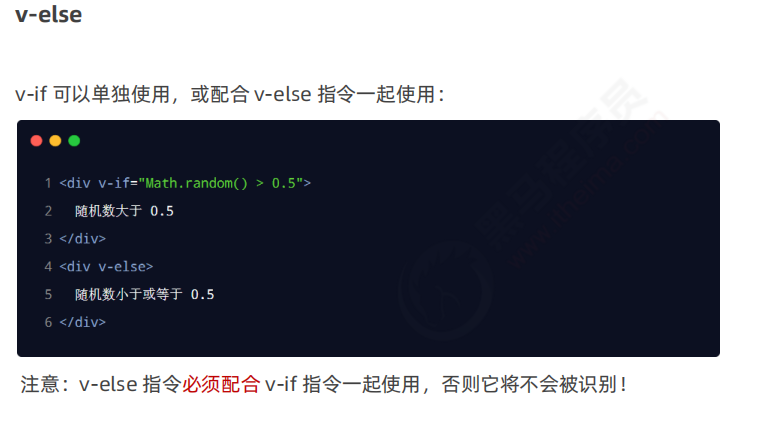


##### 列表渲染指令


>
>
>注意：item对象除了可以被li的子元素访问，同时也可以被li元素自身访问


看下面哦


>
>
>注意：索引其实不具有唯一性，因为index无法与某一项强制绑定，但id却可以


### 品牌列表案例


```javascript
<!DOCTYPE html>
<html lang="en">

<head>
  <meta charset="UTF-8">
  <meta http-equiv="X-UA-Compatible" content="IE=edge">
  <meta name="viewport" content="width=device-width, initial-scale=1.0">
  <title>品牌列表案例</title>
  <link rel="stylesheet" href="./lib/bootstrap.css">
  <link rel="stylesheet" href="./css/brandlist.css">
</head>

<body>

  <div id="app">
    <!-- 卡片区域 -->
    <div class="card">
      <div class="card-header">
        添加品牌
      </div>
      <div class="card-body">
        <!-- 添加品牌的表单区域 -->
        <form @submit.prevent="add">
          <div class="form-row align-items-center">
            <div class="col-auto">
              <div class="input-group mb-2">
                <div class="input-group-prepend">
                  <div class="input-group-text">品牌名称</div>
                </div>
                <input type="text" class="form-control" placeholder="请输入品牌名称" v-model.trim="brand">
              </div>
            </div>
            <div class="col-auto">
              <button type="submit" class="btn btn-primary mb-2">添加</button>
            </div>
          </div>
        </form>
      </div>
    </div>

    <!-- 表格区域 -->
    <table class="table table-bordered table-hover table-striped">
      <thead>
        <tr>
          <th scope="col">#</th>
          <th scope="col">品牌名称</th>
          <th scope="col">状态</th>
          <th scope="col">创建时间</th>
          <th scope="col">操作</th>
        </tr>
      </thead>
      <tbody>
        <tr v-for="item in list" :key="item.id">
          <td>{{ item.id }}</td>
          <td>{{item.name}}</td>
          <td> 
            <div class="custom-control custom-switch">
              <input type="checkbox" class="custom-control-input" :id="
              'cb'+item.id" v-model="item.status">
              <label class="custom-control-label" :for="'cb'+item.id" v-if="item.status===true">已启用</label>
              <label class="custom-control-label" :for="'cb'+item.id" v-if="item.status===false">已禁用</label>
            </div>
            <!-- 注意label标签的for属性的作用 -->
            <!-- 注意动态绑定属性的使用时机 -->
          </td>
          <td>2022-02-02 11:34:07</td>
          <td>
            <a href="javascript:;"  @click="remove(item.id)">删除</a>
          </td>
        </tr>
      </tbody>
    </table>
  </div>
  <script src="./lib/vue-2.6.12.js"></script>
  <script>
    const vm=new Vue({
      el:"#app",
      data:{
        nextId:4,
        brand:'',
        list:[{id:1,name:"宝马",status:true,time:new Date()},
              {id:2,name:"奥迪",status:true,time:new Date()},
              {id:3,name:"奔驰",status:true,time:new Date()}
      ]
      },
      methods:{
        remove(id) {
          this.list=this.list.filter(item=>item.id!=id)
        },
        add() {
          if(this.brand==='') return alert('请输入正确的品牌名')
          const obj={
            id:this.nextId,
            name:this.brand,
            status:true,
            time:new Date()
          }
          // 利用数组push()方法为数组末尾添加一个元素
          this.list.push(obj)
          this.brand=''
          this.nextId++
        }
      }
    })
  </script>
</body>

</html>
```


### 过滤器


```javascript
<!DOCTYPE html>
<html lang="en">

<head>
  <meta charset="UTF-8">
  <meta http-equiv="X-UA-Compatible" content="IE=edge">
  <meta name="viewport" content="width=device-width, initial-scale=1.0">
  <title>Document</title>
</head>

<body>
  <div id="app">
    <p>message 的值是：{{ message | capi }}</p>
  </div>

  <script src="./lib/vue-2.6.12.js"></script>
  <script>
    const vm = new Vue({
      el: '#app',
      data: {
        message: 'hello vue.js'
      },
      // 过滤器函数，必须被定义到 filters 节点之下
      // 过滤器本质上是函数
      filters: {
        // 注意：过滤器函数形参中的 val，永远都是“管道符”前面的那个值
        capi(val) {
          // 字符串有 charAt 方法，这个方法接收索引值，表示从字符串中把索引对应的字符，获取出来
          // val.charAt(0)
          const first = val.charAt(0).toUpperCase()
          // 字符串的 slice 方法，可以截取字符串，从指定索引往后截取
          const other = val.slice(1)
          // 强调：过滤器中，一定要有一个返回值
          return first + other
        }
      }
    })
  </script>
</body>

</html>
```


>注意：1.第二个参数函数中的形参也是指管道符前的那个对象
>
>2.如果全局过滤器和私有过滤器名字相同而引起冲突，则遵循就近原则，调用私有过滤器
>
>3.如果未定义过滤器而直接调用，会报错，failed to reslove filter：过滤器的名字（如下）


```javascript
<!DOCTYPE html>
<html lang="en">

<head>
  <meta charset="UTF-8">
  <meta http-equiv="X-UA-Compatible" content="IE=edge">
  <meta name="viewport" content="width=device-width, initial-scale=1.0">
  <title>Document</title>
</head>

<body>
  <div id="app">
    <p>message 的值是：{{ message | capi }}</p>
  </div>

  <div id="app2">
    <p>message 的值是：{{ message | capi }}</p>
  </div>

  <script src="./lib/vue-2.6.12.js"></script>
  <script>
    // 使用 Vue.filter() 定义全局过滤器
    Vue.filter('capi', function (str) {
      const first = str.charAt(0).toUpperCase()
      const other = str.slice(1)
      return first + other + '~~~'
    })

    const vm = new Vue({
      el: '#app',
      data: {
        message: 'hello vue.js'
      },
      // 过滤器函数，必须被定义到 filters 节点之下
      // 过滤器本质上是函数
      filters: {
        // 注意：过滤器函数形参中的 val，永远都是“管道符”前面的那个值
        capi(val) {
          // 字符串有 charAt 方法，这个方法接收索引值，表示从字符串中把索引对应的字符，获取出来
          // val.charAt(0)
          const first = val.charAt(0).toUpperCase()
          // 字符串的 slice 方法，可以截取字符串，从指定索引往后截取
          const other = val.slice(1)
          // 强调：过滤器中，一定要有一个返回值
          return first + other
        }
      }
    })

    // ----------------------------------

    const vm2 = new Vue({
      el: '#app2',
      data: {
        message: 'heima'
      }
    })
  </script>
</body>

</html>
```


总结：

### 推荐大家安装的 VScode 中的 Vue 插件

1. Vue 3 Snippets     https://marketplace.visualstudio.com/items?itemName=hollowtree.vue-snippets
2. Vetur                    https://marketplace.visualstudio.com/items?itemName=octref.vetur


什么是 vue

1. 构建用户界面
   + 用 vue 往 html 页面中填充数据，非常的方便
2. 框架
   + 框架是一套现成的解决方案，程序员只能遵守框架的规范，去编写自己的业务功能！
   + 要学习 vue，就是在学习 vue 框架中规定的用法！
   + vue 的指令、组件（是对 UI 结构的复用）、路由、Vuex、vue 组件库
   + 只有把上面老师罗列的内容掌握以后，才有开发 vue 项目的能力！


vue 的两个特性

1. 数据驱动视图：

   + 数据的变化**会驱动视图**自动更新
   + 好处：程序员只管把数据维护好，那么页面结构会被 vue 自动渲染出来！

2. 双向数据绑定：

   > 在网页中，form 表单负责**采集数据**，Ajax 负责**提交数据**。

   + js 数据的变化，会被自动渲染到页面上
   + 页面上表单采集的数据发生变化的时候，会被 vue 自动获取到，并更新到 js 数据中

> 注意：数据驱动视图和双向数据绑定的底层原理是 MVVM（Mode 数据源、View 视图、ViewModel 就是 vue 的实例）


vue 指令


1. 内容渲染指令

1. `v-text` 指令的缺点：会覆盖元素内部原有的内容！
2. `{{ }}` 插值表达式：在实际开发中用的最多，只是内容的占位符，不会覆盖原有的内容！
3. `v-html` 指令的作用：可以把带有标签的字符串，渲染成真正的 HTML 内容！


2. 属性绑定指令

>  注意：插值表达式只能用在元素的**内容节点**中，不能用在元素的**属性节点**中！

+ 在 vue 中，可以使用 `v-bind:` 指令，为元素的属性动态绑定值；

+ 简写是英文的 `:`

+ 在使用 v-bind 属性绑定期间，如果绑定内容需要进行动态拼接，则字符串的外面应该包裹单引号，例如：

  ```xml
  <div :title="'box' + index">这是一个 div</div>
  ```


3. 事件绑定

1. `v-on:` 简写是 `@`

2. 语法格式为：

   ```xml
   <button @click="add"></button>
   
   methods: {
      add() {
   			// 如果在方法中要修改 data 中的数据，可以通过 this 访问到
   			this.count += 1
      }
   }
   ```

3. `$event` 的应用场景：如果默认的事件对象 e 被覆盖了，则可以手动传递一个  $event。例如：

   ```xml
   <button @click="add(3, $event)"></button>
   
   methods: {
      add(n, e) {
   			// 如果在方法中要修改 data 中的数据，可以通过 this 访问到
   			this.count += 1
      }
   }
   ```

4. 事件修饰符：

   + `.prevent`

     ```xml
     <a @click.prevent="xxx">链接</a>
     ```

   + `.stop`

     ```xml
     <button @click.stop="xxx">按钮</button>
     ```

     

4. v-model 指令

1. input 输入框
   + type="radio"
   + type="checkbox"
   + type="xxxx"
2. textarea
3. select


5. 条件渲染指令

1. `v-show` 的原理是：动态为元素添加或移除 `display: none` 样式，来实现元素的显示和隐藏
   + 如果要频繁的切换元素的显示状态，用 v-show 性能会更好
2. `v-if` 的原理是：每次动态创建或移除元素，实现元素的显示和隐藏
   + 如果刚进入页面的时候，某些元素默认不需要被展示，而且后期这个元素很可能也不需要被展示出来，此时 v-if 性能更好

>  在实际开发中，绝大多数情况，不用考虑性能问题，直接使用 v-if 就好了！！！


v-if 指令在使用的时候，有两种方式：

1. 直接给定一个布尔值 true 或 false

   ```xml
   <p v-if="true">被 v-if 控制的元素</p>
   ```

2. 给 v-if 提供一个判断条件，根据判断的结果是 true 或 false，来控制元素的显示和隐藏

   ```xml
   <p v-if="type === 'A'">良好</p>
   ```

   

   ### 疑难点突破

   通过`this`直接访问到`methods`里面的函数的原因是：因为`methods`里的方法通过 `bind` 指定了`this`为 `new Vue`的实例(`vm`)。

   通过 `this` 直接访问到 `data` 里面的数据的原因是：data里的属性最终会存储到`new Vue`的实例（`vm`）上的 `_data`对象中，访问 `this.xxx`，是访问`Object.defineProperty`代理后的 `this._data.xxx`。


## Vue基础入门


### 侦听器

1. 方法格式的侦听器
   + 缺点1：无法在刚进入页面的时候，自动触发！！！
   + 缺点2：如果侦听的是一个对象，如果对象中的属性发生了变化，不会触发侦听器！！！因为方法格式的侦听器是直接侦听data的属性，而不能侦听data属性的属性
2. 对象格式的侦听器
   + 好处1：可以通过 **immediate** 选项，让侦听器自动触发！！！
   + 好处2：可以通过 **deep** 选项，让侦听器深度监听对象中每个属性的变化！！！


对象格式的监听器

```javascript
<!DOCTYPE html>
<html lang="en">

<head>
  <meta charset="UTF-8">
  <meta http-equiv="X-UA-Compatible" content="IE=edge">
  <meta name="viewport" content="width=device-width, initial-scale=1.0">
  <title>Document</title>
</head>

<body>
  <div id="app">
    <input type="text" v-model="username">
  </div>

  <script src="./lib/vue-2.6.12.js"></script>
  <script src="./lib/jquery-v3.6.0.js"></script>

  <script>
    const vm = new Vue({
      el: '#app',
      data: {
        username: 'admin'
      },
      // 所有的侦听器，都应该被定义到 watch 节点下
      watch: {
        // 定义对象格式的侦听器
        username: {
          // 侦听器的处理函数
          handler(newVal, oldVal) {
            console.log(newVal, oldVal)
          },
          // immediate 选项的默认值是 false
          // immediate 的作用是：控制侦听器是否自动触发一次！
          immediate: true
        }
      }
    })
  </script>
</body>

</html>
```


```javascript
<!DOCTYPE html>
<html lang="en">

<head>
  <meta charset="UTF-8">
  <meta http-equiv="X-UA-Compatible" content="IE=edge">
  <meta name="viewport" content="width=device-width, initial-scale=1.0">
  <title>Document</title>
</head>

<body>
  <div id="app">
    <input type="text" v-model="info.username">
    <input type="text" v-model="info.address.city">
  </div>

  <script src="./lib/vue-2.6.12.js"></script>
  <script src="./lib/jquery-v3.6.0.js"></script>

  <script>
    const vm = new Vue({
      el: '#app',
      data: {
        // 用户的信息对象
        info: {
          username: 'admin',
          address: {
            city: '北京'
          }
        }
      },
      // 所有的侦听器，都应该被定义到 watch 节点下
      watch: {
        /* info: {
          handler(newVal) {//注意：这里的newVal指的是info这个用户的信息对象，与方式格式对比理解
            console.log(newVal)
          },
          // 开启深度监听，只要对象中任何一个属性变化了，都会触发“对象的侦听器”
          deep: true
        } */
        // 如果要侦听的是对象的子属性的变化，则必须包裹一层单引号
        'info.username'(newVal) {
          console.log(newVal)
        }
      }
    })
  </script>
</body>

</html>
```


### 计算属性


特点：

1. 定义的时候，要被定义为“方法”
2. 在使用计算属性的时候，当普通的属性使用即可

好处：

1. 实现了代码的复用
2. 只要计算属性中依赖的数据源变化了，则计算属性会自动重新求值！

```javascript
<!DOCTYPE html>
<html lang="en">

<head>
  <meta charset="UTF-8">
  <meta name="viewport" content="width=device-width, initial-scale=1.0">
  <meta http-equiv="X-UA-Compatible" content="ie=edge">
  <title>Document</title>
  <script src="./lib/vue-2.6.12.js"></script>
  <style>
    .box {
      width: 200px;
      height: 200px;
      border: 1px solid #ccc;
    }
  </style>
</head>

<body>
  <div id="app">
    <div>
      <span>R：</span>
      <input type="text" v-model.number="r">
    </div>
    <div>
      <span>G：</span>
      <input type="text" v-model.number="g">
    </div>
    <div>
      <span>B：</span>
      <input type="text" v-model.number="b">
    </div>
    <hr>

    <!-- 专门用户呈现颜色的 div 盒子 -->
    <!-- 在属性身上，: 代表  v-bind: 属性绑定 -->
    <!-- :style 代表动态绑定一个样式对象，它的值是一个 {  } 样式对象 -->
    <!-- 当前的样式对象中，只包含 backgroundColor 背景颜色 -->
    <div class="box" :style="{ backgroundColor: rgb }">
      {{ rgb }}//各种节点的儿子属性可以在body中被任意调用
    </div>
    <button @click="show">按钮</button>
  </div>

  <script>
    // 创建 Vue 实例，得到 ViewModel
    var vm = new Vue({
      el: '#app',
      data: {
        // 红色
        r: 0,
        // 绿色
        g: 0,
        // 蓝色
        b: 0
      },
      methods: {
        // 点击按钮，在终端显示最新的颜色
        show() {
          console.log(this.rgb)
        }
      },
      // 所有的计算属性，都要定义到 computed 节点之下
      // 计算属性在定义的时候，要定义成“方法格式”
      computed: {
        // rgb 作为一个计算属性，被定义成了方法格式，
        // 最终，在这个方法中，要返回一个生成好的 rgb(x,x,x) 的字符串
        rgb() {
          return `rgb(${this.r}, ${this.g}, ${this.b})`
        }
      }
    });

    console.log(vm)
  </script>
</body>

</html>
```


### axios

用法见Ajax


>
>
>注意：axios发起请求后返回的是一个promise对象实例

#### 直接利用axios发起ajax请求

```javascript
<!DOCTYPE html>
<html lang="en">

<head>
  <meta charset="UTF-8">
  <meta http-equiv="X-UA-Compatible" content="IE=edge">
  <meta name="viewport" content="width=device-width, initial-scale=1.0">
  <title>Document</title>
</head>

<body>

  <script src="./lib/axios.js"></script>
  <script>
    // http://www.liulongbin.top:3006/api/getbooks

    // 1. 调用 axios 方法得到的返回值是 Promise 对象
    axios({
      // 请求方式
      method: 'GET',
      // 请求的地址
      url: 'http://www.liulongbin.top:3006/api/getbooks',
      // URL 中的查询参数
      params: {
        id: 1
      },
      // 请求体参数
      data: {}
    }).then(function (result) {
      console.log(result)
    })
  </script>
</body>

</html>
```


#### 结合await和async调用axios发起get和post请求

```javascript
<!DOCTYPE html>
<html lang="en">

<head>
  <meta charset="UTF-8">
  <meta http-equiv="X-UA-Compatible" content="IE=edge">
  <meta name="viewport" content="width=device-width, initial-scale=1.0">
  <title>Document</title>
</head>

<body>

  <button id="btnPost">发起POST请求</button>
  <button id="btnGet">发起GET请求</button>

  <script src="./lib/axios.js"></script>
  <script>
    document.querySelector('#btnPost').addEventListener('click', async function () {
      // 如果调用某个方法的返回值是 Promise 实例，则前面可以添加 await！
      // await 只能用在被 async “修饰”的方法中
      const { data } = await axios({
        method: 'POST',
        url: 'http://www.liulongbin.top:3006/api/post',
        data: {
          name: 'zs',
          age: 20
        }
      })

      console.log(data)
    })

    document.querySelector('#btnGet').addEventListener('click', async function () {
      // 解构赋值的时候，使用 : 进行重命名
      // 1. 调用 axios 之后，使用 async/await 进行简化
      // 2. 使用解构赋值，从 axios 封装的大对象中，把 data 属性解构出来
      // 3. 把解构出来的 data 属性，使用 冒号 进行重命名，一般都重命名为 { data: res }
      const { data: res } = await axios({
        method: 'GET',
        url: 'http://www.liulongbin.top:3006/api/getbooks'
      })

      console.log(res.data)
    })

    // $.ajax()   $.get()  $.post()
    // axios()    axios.get()    axios.post()    axios.delete()   axios.put()
  </script>
</body>

</html>
```

#### 基于axios.get和axios.post发起请求

```javascript
<!DOCTYPE html>
<html lang="en">

<head>
  <meta charset="UTF-8">
  <meta http-equiv="X-UA-Compatible" content="IE=edge">
  <meta name="viewport" content="width=device-width, initial-scale=1.0">
  <title>Document</title>
</head>

<body>
  <button id="btnGET">GET</button>
  <button id="btnPOST">POST</button>

  <script src="./lib/axios.js"></script>
  <script>
    document.querySelector('#btnGET').addEventListener('click', async function () {
      /* axios.get('url地址', {
        // GET 参数
        params: {}
      }) */

      const { data: res } = await axios.get('http://www.liulongbin.top:3006/api/getbooks', {
        params: { id: 1 }
      })
      console.log(res)
    })

    document.querySelector('#btnPOST').addEventListener('click', async function () {
      // axios.post('url', { /* POST 请求体数据 */ })
      const { data: res } = await axios.post('http://www.liulongbin.top:3006/api/post', { name: 'zs', gender: '女' })
      console.log(res)
    })
  </script>
</body>

</html>
```


### vue-cli


>
>
>注意：1.cmd输入vue -V不报错说明安装成功
>
>2.项目名称不能用中文


vue-cli创建项目步骤截图

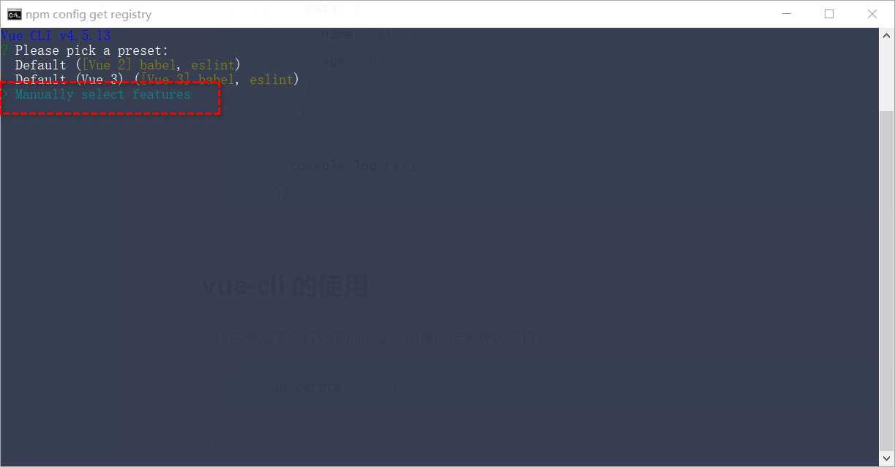

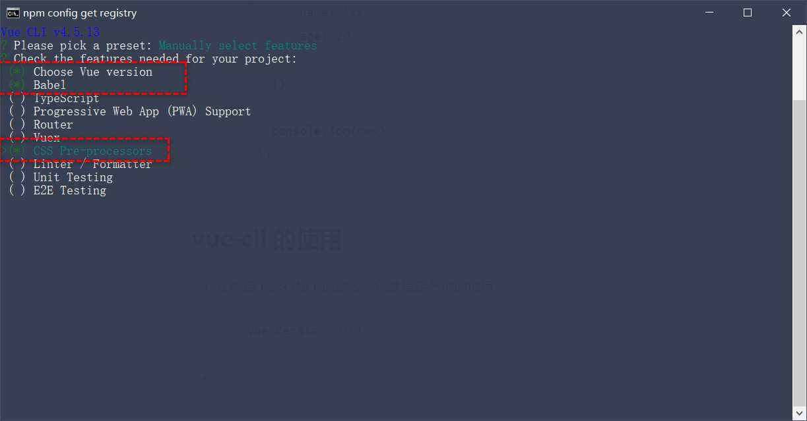


### Vue组件

#### 组件的基础


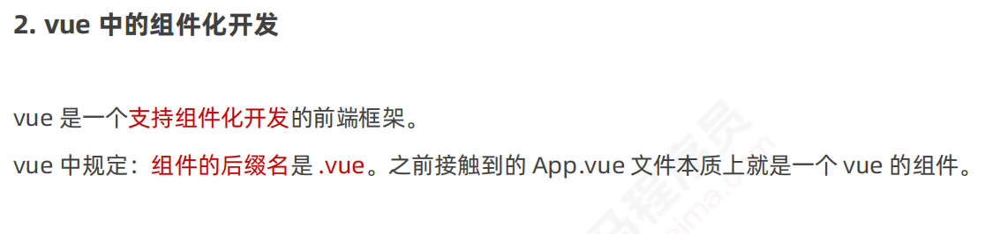


>
>
>注意：快速创建vue组件结构的快捷键：键入>后选择第一个项目


>
>
>注意：script下export deafult里的用法和vue实例对象类似


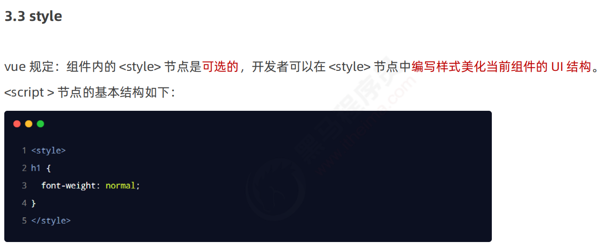


App.vue

```vue
<template>
  <div>
    <div class="test-box">
      <h3>这是用户自定义的 Test.vue --- {{ username }}</h3>
      <button @click="chagneName">修改用户名</button>
    </div>
    <div>123</div>
  </div>
</template>
<!-- template之中只能有一个根节点，即只能所有结构只能被一对div包起来 -->
<script>
// 默认导出。这是固定写法！
export default {
  // data 数据源
  // 注意：.vue 组件中的 data 不能像之前一样，不能指向对象。
  // 注意：组件中的 data 必须是一个函数
  data() {
    // 这个 return 出去的 { } 中，可以定义数据
    return {
      username: 'admin'
    }
  },
  methods: {
    chagneName() {
      // 在组件中， this 就表示当前组件的实例对象
      console.log(this)
      this.username = '哇哈哈'
    }
  },
  // 当前组件中的侦听器
  watch: {},
  // 当前组件中的计算属性
  computed: {},
  // 当前组件中的过滤器
  filters: {}
}
</script>
<!-- 启动less语法以及根节点具有唯一性 -->
<!-- 必须是less语法，故必须有lang=less -->
<style lang="less">
.test-box {
  background-color: pink;
  h3 {
    color: red;
  }
}
</style>

```


main.js

```js
// 导入 vue 这个包，得到 Vue 构造函数
import Vue from 'vue'
// 导入 App.vue 根组件，将来要把 App.vue 中的模板结构，渲染到 HTML 页面中
// import App from './App.vue'
import Test from './Test.vue'

Vue.config.productionTip = false

// 创建 Vue 的实例对象
new Vue({
  // 把 render 函数指定的组件，渲染到 HTML 页面中,render函数指定的组件就是根节点
  render: h => h(Test)
}).$mount('#app')

// Vue 实例的 $mount() 方法，作用和 el 属性完全一样！

```


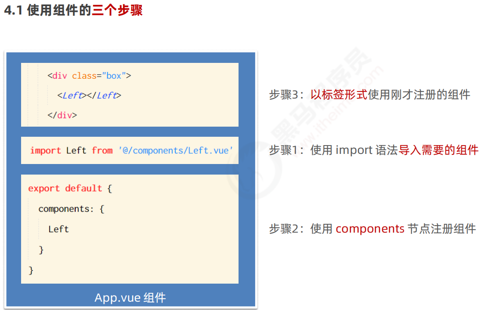


>
>
>注意：用v-bind动态绑定自定义属性init时init属性的值是个数字，不用则仅仅是个字符串


 


#### 组件的基本使用


scope属性


>
>
>属性选择器：
>
>```
>/* 存在 href 属性并且属性值匹配"https://example.org"的<a> 元素 */
>a[href="https://example.org"] {
>  color: green;
>}
>```

/deep/样式穿透


理解：1.导入组件并以标签的形式使用时，组件才完成了实例化

   		 2.浏览器只能识别js代码，因为有js引擎，vue必须经过vue-template-compiler后被解析成js代码才可以被浏览器识别

 


总结：


过滤器

过滤器的注意点

1. 要定义到 filters 节点下，**本质是一个函数**
2. 在过滤器函数中，**一定要有 return 值**
3. 在过滤器的形参中，可以获取到“管道符”前面待处理的那个值
4. 如果全局过滤器和私有过滤器名字一致，此时按照“**就近原则**”，调用的是”私有过滤器“


watch 侦听器


侦听器的格式

1. 方法格式的侦听器
   + 缺点1：无法在刚进入页面的时候，自动触发！！！
   + 缺点2：如果侦听的是一个对象，如果对象中的属性发生了变化，不会触发侦听器！！！因为方法格式的侦听器是直接侦听data的属性，而不能侦听data属性的属性
2. 对象格式的侦听器
   + 好处1：可以通过 **immediate** 选项，让侦听器自动触发！！！
   + 好处2：可以通过 **deep** 选项，让侦听器深度监听对象中每个属性的变化！！！


计算属性


特点：

1. 定义的时候，要被定义为“方法”
2. 在使用计算属性的时候，当普通的属性使用即可

好处：

1. 实现了代码的复用
2. 只要计算属性中依赖的数据源变化了，则计算属性会自动重新求值！


axios

> axios 是一个专注于网络请求的库！


axios 的基本使用

1. 发起 GET 请求：

   ```js
   axios({
     // 请求方式
     method: 'GET',
     // 请求的地址
     url: 'http://www.liulongbin.top:3006/api/getbooks',
     // URL 中的查询参数
     params: {
       id: 1
     }
   }).then(function (result) {
     console.log(result)
   })
   ```

2. 发起 POST 请求：

   ```js
   document.querySelector('#btnPost').addEventListener('click', async function () {
     // 如果调用某个方法的返回值是 Promise 实例，则前面可以添加 await！
     // await 只能用在被 async “修饰”的方法中
     const { data: res } = await axios({
       method: 'POST', 
       url: 'http://www.liulongbin.top:3006/api/post',
       data: {
         name: 'zs',
         age: 20
       }
     })
   
     console.log(res)
   })
   ```


vue-cli 的使用

1. 在终端下运行如下的命令，创建指定名称的项目：

   ```bash
   vue cerate 项目的名称
   ```

2. vue 项目中 src 目录的构成：

   ```
   assets 文件夹：存放项目中用到的静态资源文件，例如：css 样式表、图片资源
   components 文件夹：程序员封装的、可复用的组件，都要放到 components 目录下
   main.js 是项目的入口文件。整个项目的运行，要先执行 main.js
   App.vue 是项目的根组件。
   ```

   

## 生命周期&数据共享


### 组件的生命周期


>
>
>注意：只有当组件以标签形式被使用时，才算创建了一个实例对象，这里的创建不是指组件文件被创建，指的是组件实例化


>
>
>注意:其中的new Vue（）就是创建一个vue实例，即以标签形式使用组件时，就是new Vue（）过程


### 组件之间的数据共享


>
>
>注意：只要不是父子关系，都可以被认定是兄弟关系，例如A和G


>
>
>注意：必须通过动态属性绑定来传递数据，因为动态绑定的属性的双引号中默认识别为js语句，而非动态绑定的属性的双引号中默认识别为常量，通常为字符串

简单数据类型赋值和复杂数据类型赋值的区别以及子对父的影响误区


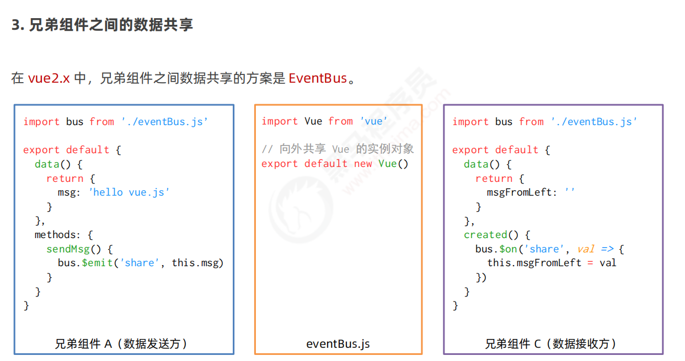


>
>
>理解：bus只是一个中间件，为bus绑定了share事件，$on方法只是监听bus 的share事件
>
>反思：多去理解为什么


### ref引用


上述代码会报错，can not read property focus of undifined ，意思是不能找到undifined的属性focus，原因是在inputVisible的值更新为true后，页面的dom结构并未更新，具体流程见组件的生命周期图，此时输入框还未被创建，故此时找不到input元素，所以是undifined ，从而报错

>
>
>注意：不能使用update生命周期函数，因为每次数据变化都会触发该函数，第一次聚焦后再失去焦点时会报错，因为失去焦点时input会被动态删除，此时找不到input元素，会报同上的错误，即undifined


#### 数组的some方法

```js
<body>
//都是遍历数组的方法，效率不同
  <script>
    const arr = ['小红', '你大红', '苏大强', '宝']

    // forEach 循环一旦开始，无法在中间被停止
    /* arr.forEach((item, index) => {
      console.log('object')
      if (item === '苏大强') {
        console.log(index)
      }
    }) */

    arr.some((item, index) => {
      console.log('ok')
      if (item === '苏大强') {
        console.log(index)
        // 在找到对应的项之后，可以通过 return true 固定的语法，来终止 some 循环
        return true
      }
    })
  </script>
</body>
```


#### 数组的every方法

```js
<body>
    //判断数组中的每一项是否都满足特定的条件，若所有项都满足则返回一个true，否则返回一个false
  <script>
    const arr = [
      { id: 1, name: '西瓜', state: true },
      { id: 2, name: '榴莲', state: false },
      { id: 3, name: '草莓', state: true },
    ]

    // 需求：判断数组中，水果是否被全选了！
    const result = arr.every(item => item.state)
    console.log(result)
  </script>
</body>
```


#### 数组的reduce方法

```js
<body>
    //reduce方法即是对数组循环累加的方法
  <script>
    const arr = [
      { id: 1, name: '西瓜', state: true, price: 10, count: 1 },
      { id: 2, name: '榴莲', state: false, price: 80, count: 2 },
      { id: 3, name: '草莓', state: true, price: 20, count: 3 },
    ]

    // 需求：把购物车数组中，已勾选的水果，总价累加起来！
    /* let amt = 0 // 总价
        arr.filter(item => item.state).forEach(item => {
          amt += item.price * item.count
        })
    
        console.log(amt) */

    // arr.filter(item => item.state).reduce((累加的结果, 当前循环项) => { }, 初始值)
    const result = arr.filter(item => item.state).reduce((amt, item) => amt += item.price * item.count, 0)//把每次累加的结果作为下次循环的第一个形参

    console.log(result)
  </script>
</body>
```


### 购物车案例


分析封装props两种方案的优缺点

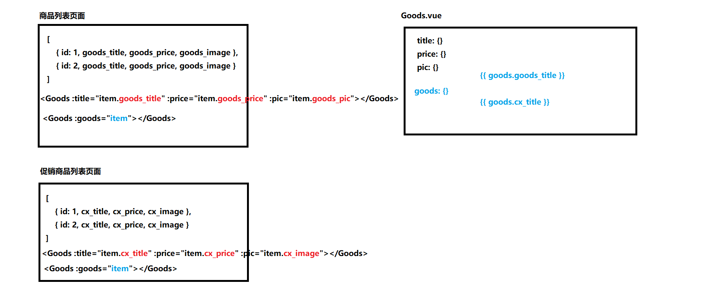


分析如何修改商品的勾选状态

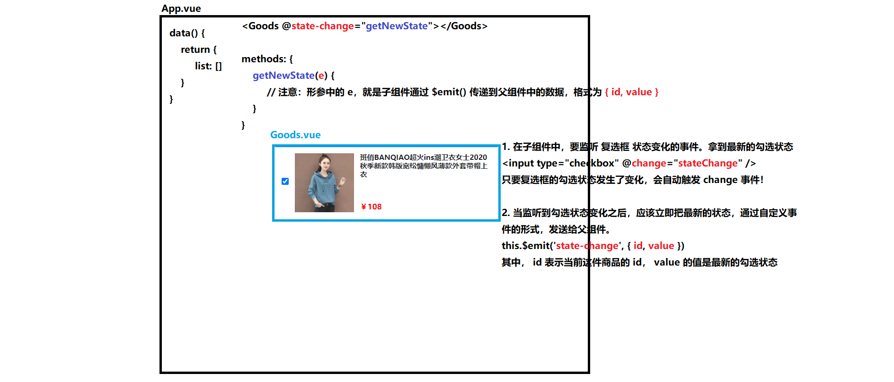


**项目课总结：1. 锻炼自学能力**

​       				 **2.锻炼debug能力**

​						**3.锻炼解决问题能力（完成需求能力）**

​			


## 动态组件&插槽&自定义组件

day6


### 动态组件

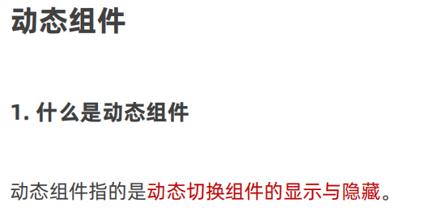


矛盾属性：exclude 指定的组件实例不会被缓存 ，与include不能同时出现，eg.exclude="Right"

 则Right组件不会被缓存

>
>
>了解组件注册名称和组件声明时name的区别

App.vue

```vue
<template>
  <div class="app-container">
    <h1>App 根组件</h1>
    <hr />

    <button @click="comName = 'Left'">展示 Left</button>
    <button @click="comName = 'Right'">展示 Right</button>

    <div class="box">
      <!-- 渲染 Left 组件和 Right 组件 -->
      <!-- 1. component 标签是 vue 内置的，作用：组件的占位符 -->
      <!-- 2. is 属性的值，表示要渲染的组件的名字 -->
      <!-- 3. is 属性的值，应该是组件在 components 节点下的注册名称 -->

      <!-- keep-alive 会把内部的组件进行缓存，而不是销毁组件 -->
      <!-- 在使用 keep-alive 的时候，可以通过 include 指定哪些组件需要被缓存； -->
      <!-- 或者，通过 exclude 属性指定哪些组件不需要被缓存；但是：不要同时使用 include 和 exclude 这两个属性 -->
      <keep-alive exclude="MyRight">
        <component :is="comName"></component>
      </keep-alive>
    </div>
  </div>
</template>

<script>
import Left from '@/components/Left.vue'
import Right from '@/components/Right.vue'

export default {
  data() {
    return {
      // comName 表示要展示的组件的名字
      comName: 'Left'
    }
  },
  components: {
    // 如果在“声明组件”的时候，没有为组件指定 name 名称，则组件的名称默认就是“注册时候的名称”
    Left,
    Right
  }
}
</script>

<style lang="less">
.app-container {
  padding: 1px 20px 20px;
  background-color: #efefef;
}
.box {
  display: flex;
}
</style>

```


Right.vue

```vue
<template>
  <div class="right-container">
    <h3>Right 组件</h3>
  </div>
</template>

<script>
export default {
  // 当提供了 name 属性之后，组件的名称，就是 name 属性的值
  // 对比：
  // 1. 组件的 “注册名称” 的主要应用场景是：以标签的形式，把注册好的组件，渲染和使用到页面结构之中
  // 2. 组件声明时候的 “name” 名称的主要应用场景：结合 <keep-alive> 标签实现组件缓存功能；以及在调试工具中看到组件的 name 名称
  name: 'MyRight'
}
</script>

<style lang="less">
.right-container {
  padding: 0 20px 20px;
  background-color: lightskyblue;
  min-height: 250px;
  flex: 1;
}
</style>

```


### 插槽


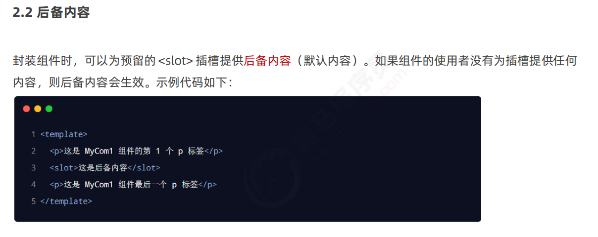

、


App.vue

```vue
<template>
  <div class="app-container">
    <h1 v-color="color">App 根组件</h1>
    <p v-color="'red'">测试</p>

    <button @click="color = 'green'">改变 color 的颜色值</button>
    <hr />

    <Article>
      <template #title>
        <h3>一首诗</h3>
      </template>

      <template #content="{ msg, user }">
        <div>
          <p>啊，大海，全是水。</p>
          <p>啊，蜈蚣，全是腿。</p>
          <p>啊，辣椒，净辣嘴。</p>
          <p>{{ msg }}</p>
          <p>{{ user.name }}</p>
        </div>
      </template>

      <template #author>
        <div>作者：彬果锅</div>
      </template>
    </Article>

    <hr />

    <div class="box" style="display: none;">
      <!-- 渲染 Left 组件和 Right 组件 -->
      <Left>
        <!-- 默认情况下，在使用组件的时候，提供的内容都会被填充到名字为 default 的插槽之中 -->
        <!-- 1. 如果要把内容填充到指定名称的插槽中，需要使用 v-slot: 这个指令 -->
        <!-- 2. v-slot: 后面要跟上插槽的名字 -->
        <!-- 3. v-slot: 指令不能直接用在元素身上，必须用在 template 标签上 -->
        <!-- 4. template 这个标签，它是一个虚拟的标签，只起到包裹性质的作用，但是，不会被渲染为任何实质性的 html 元素 -->
        <!-- 5. v-slot: 指令的简写形式是 # -->
        <template #default>
          <p>这是在 Left 组件的内容区域，声明的 p 标签</p>
        </template>
      </Left>
    </div>
  </div>
</template>

<script>
import Left from '@/components/Left.vue'
import Article from '@/components/Article.vue'

export default {
  data() {
    return {
      color: 'blue'
    }
  },
  components: {
    Left,
    Article
  },
  // 私有自定义指令的节点
  directives: {
    // 定义名为 color 的指令，指向一个配置对象
    /* color: {
      // 当指令第一次被绑定到元素上的时候，会立即触发 bind 函数
      // 形参中的 el 表示当前指令所绑定到的那个 DOM 对象
      bind(el, binding) {
        console.log('触发了 v-color 的 bind 函数')
        el.style.color = binding.value
      },
      // 在 DOM 更新的时候，会触发 update 函数
      update(el, binding) {
        console.log('触发了 v-color 的 update 函数')
        el.style.color = binding.value
      }
    } */
    color(el, binding) {
      el.style.color = binding.value
    }
  }
}
</script>

<style lang="less">
.app-container {
  padding: 1px 20px 20px;
  background-color: #efefef;
}
.box {
  display: flex;
}
</style>

```


>
>
>注意：v-slot指令只能用在组件或者template标签上


>
>
>注意：$event参数除了可以用于接受点击对象外，还可以用来接受多个参数中被覆盖的那一项

看

### 自定义指令


